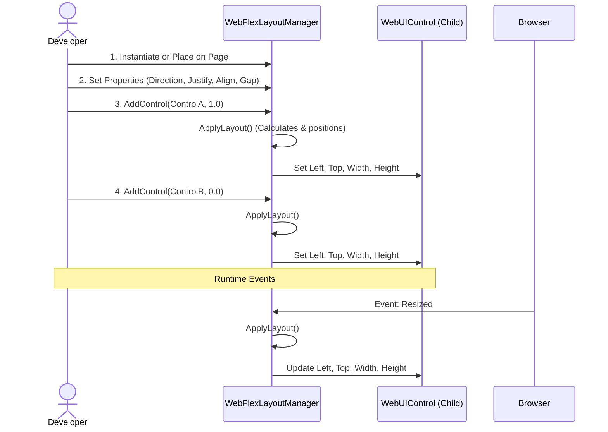
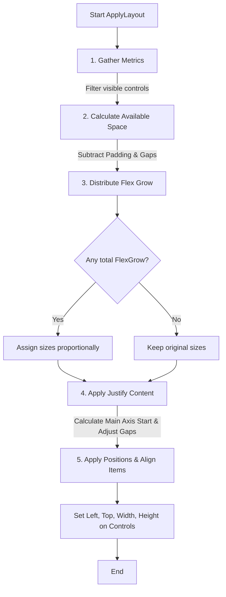

# WebFlexLayoutManager Documentation

The `WebFlexLayoutManager` is a custom UI component for Xojo Web (inheriting from `WebRectangle`). It provides a CSS Flexbox-like layout engine directly within Xojo code. It dynamically positions and sizes child controls added to it, taking the burden of manual UI coordinate calculations off the developer.

## Inheritance and Initialization

The layout manager is built on top of `WebRectangle`, giving it visual bounds on the web page. When initialized, it creates a dictionary to track the flex-grow values of the controls it manages.

```vb
Protected Class WebFlexLayoutManager
Inherits WebRectangle

	Sub Constructor()
	  // Calling the overridden superclass constructor.
	  Super.Constructor
	  
	  FlexGrowMap = New Dictionary
	End Sub
```

## How to Use It (Sequence Diagram)

This sequence diagram illustrates how a developer interacts with the `WebFlexLayoutManager` and how it responds to window resizing.



### Event Handling
The layout manager automatically recalculates when the browser window is resized or when it is first shown. To handle early rendering issues in browsers, a JavaScript event dispatch is triggered when the manager is shown.

```vb
	Sub Resized()
	  ApplyLayout()
	End Sub

	Sub Shown()
	  Me.ExecuteJavaScript("setTimeout(function(){ window.dispatchEvent(new Event('resize')); }, 50);")
	End Sub
```

## Adding Controls to the Layout

To have the manager position a control, use `AddControl()`. You provide the control reference and an optional `growFactor`. The `growFactor` dictates how much of the remaining space the control should consume proportionally. An `ApplyLayout()` is triggered immediately to position the new control.

```vb
	Sub AddControl(c As WebUIControl, growFactor As Double = 0)
	  If c = Nil Then Return
	  
	  System.DebugLog("FlexLayoutManager: Adding control " + c.Name + " with growFactor " + Str(growFactor))
	  
	  ManagedControls.Add(c)
	  FlexGrowMap.Value(c) = growFactor
	  
	  ApplyLayout()
	End Sub
```

## Layout Algorithm Flowchart

When `ApplyLayout()` is called, the manager performs the following 5-step process:



### Step 1: Gather Metrics
The manager iterates over `ManagedControls`, skipping invisible ones. It calculates the total flex-grow factor across all controls, and sums the size (width or height, depending on direction) of controls that have a `growFactor` of 0.

```vb
  Var visibleControls() As WebUIControl
  Var totalFlexGrow As Double = 0
  Var totalFixedSpace As Integer = 0
  
  For Each c As WebUIControl In ManagedControls
    If c.Visible Then
      visibleControls.Add(c)
      
      Var grow As Double = 0
      If FlexGrowMap.HasKey(c) Then grow = FlexGrowMap.Value(c)
      
      totalFlexGrow = totalFlexGrow + grow
      
      If grow = 0 Then
        If Direction = FlexDirection.Row Then
          totalFixedSpace = totalFixedSpace + c.Width
        Else
          totalFixedSpace = totalFixedSpace + c.Height
        End If
      End If
    End If
  Next
```

### Step 2: Calculate Available Space
The internal dimensions of the layout container are calculated by taking the total size minus the configured padding bounds. It then subtracts the size consumed by gaps and fixed-size elements to determine `remainingSpace`.

```vb
  Var availableMainSpace As Integer
  Var availableCrossSpace As Integer
  
  If Direction = FlexDirection.Row Then
    availableMainSpace = Me.Width - PaddingLeft - PaddingRight
    availableCrossSpace = Me.Height - PaddingTop - PaddingBottom
  Else
    availableMainSpace = Me.Height - PaddingTop - PaddingBottom
    availableCrossSpace = Me.Width - PaddingLeft - PaddingRight
  End If
  
  // Calculate gap space
  Var totalGapSpace As Integer = 0
  If visibleControls.Count > 1 Then
    totalGapSpace = (visibleControls.Count - 1) * Gap
  End If
  
  Var remainingSpace As Integer = availableMainSpace - totalFixedSpace - totalGapSpace
  If remainingSpace < 0 Then remainingSpace = 0
```

### Step 3: Distribute Flex Grow
Controls with a `growFactor > 0` are resized to take a fraction of `remainingSpace` based on their factor relative to the `totalFlexGrow`.

```vb
  For Each c As WebUIControl In visibleControls
    Var size As Integer
    Var grow As Double = 0
    If FlexGrowMap.HasKey(c) Then grow = FlexGrowMap.Value(c)
    
    If grow > 0 And totalFlexGrow > 0 Then
      // Distribute remaining space proportionally
      size = Round((grow / totalFlexGrow) * remainingSpace)
    Else
      // Keep original size for fixed controls
      If Direction = FlexDirection.Row Then
        size = c.Width
      Else
        size = c.Height
      End If
    End If
    
    mainSizes.Add(size)
    totalUsedSpace = totalUsedSpace + size
  Next
```

### Step 4: Apply Justify Content
If no items are meant to grow (`totalFlexGrow = 0`), the layout engine determines where the first item starts and how gaps are distributed based on the `Justify` enum setting. 

```vb
  Select Case Justify
  Case JustifyContent.Center
    Var totalItemsAndGaps As Integer = totalFixedSpace + totalGapSpace
    Var startOffset As Double = (availableMainSpace - totalItemsAndGaps) / 2.0
    If Direction = FlexDirection.Row Then
      currentMainPos = PaddingLeft + startOffset
    Else
      currentMainPos = PaddingTop + startOffset
    End If
    
  Case JustifyContent.SpaceBetween
    // Pushes first to start, last to end, recalculates gap
    If Direction = FlexDirection.Row Then
      currentMainPos = PaddingLeft
    End If
    If visibleControls.Count > 1 Then
      actualGap = (availableMainSpace - totalFixedSpace) / (visibleControls.Count - 1)
    End If
  End Select
```

### Step 5: Position each control
Finally, the cross-axis coordinates are determined using the `Align` setting. The Xojo control properties (`Left`, `Top`, `Width`, `Height`) are updated explicitly, and the loop advances to position the next control.

```vb
  For i As Integer = 0 To visibleControls.LastIndex
    Var c As WebUIControl = visibleControls(i)
    Var mainSize As Integer = mainSizes(i)
    Var crossPos As Integer
    Var crossSize As Integer
    
    // Example: cross-axis calculation for Center alignment
    If Align = AlignItems.Center Then
      If Direction = FlexDirection.Row Then
        crossPos = PaddingTop + Round((availableCrossSpace - crossSize) / 2.0)
      Else
        crossPos = PaddingLeft + Round((availableCrossSpace - crossSize) / 2.0)
      End If
    End If
    
    // Apply physical location to UI control
    If Direction = FlexDirection.Row Then
      c.Left = Round(currentMainPos)
      c.Top = crossPos
      c.Width = mainSize
      c.Height = crossSize
    Else
      c.Left = crossPos
      c.Top = Round(currentMainPos)
      c.Width = crossSize
      c.Height = mainSize
    End If
    
    // Advance tracking position for next item in loop
    currentMainPos = currentMainPos + mainSize + actualGap
  Next
```

## API Reference

### Enums
*   **FlexDirection**: `Row` (0), `Column` (1). Defines the main layout axis.
*   **JustifyContent**: `FlexStart`, `FlexEnd`, `Center`, `SpaceBetween`, `SpaceAround`, `Stretch`. Defines how space is distributed along the main axis.
*   **AlignItems**: `FlexStart`, `FlexEnd`, `Center`, `Stretch`. Defines how controls align along the cross axis.

### Properties
*   `Direction` (FlexDirection): The primary axis direction.
*   `Justify` (JustifyContent): Alignment on the main axis.
*   `Align` (AlignItems): Alignment on the cross axis.
*   `Gap` (Integer): Spacing between controls.
*   `PaddingLeft`, `PaddingTop`, `PaddingRight`, `PaddingBottom` (Integer): Inner margins of the layout container.

### Methods
*   `AddControl(c As WebUIControl, growFactor As Double = 0)`: Registers a control to be managed by the layout. The `growFactor` determines how much of the remaining space it should take.
*   `SetFlexGrow(c As WebUIControl, growFactor As Double)`: Updates the grow factor of an already added control.
*   `RemoveAllControls()`: Clears all managed controls from the layout.
*   `ApplyLayout()`: Force recalculates the positions. Automatically called on Resize.
