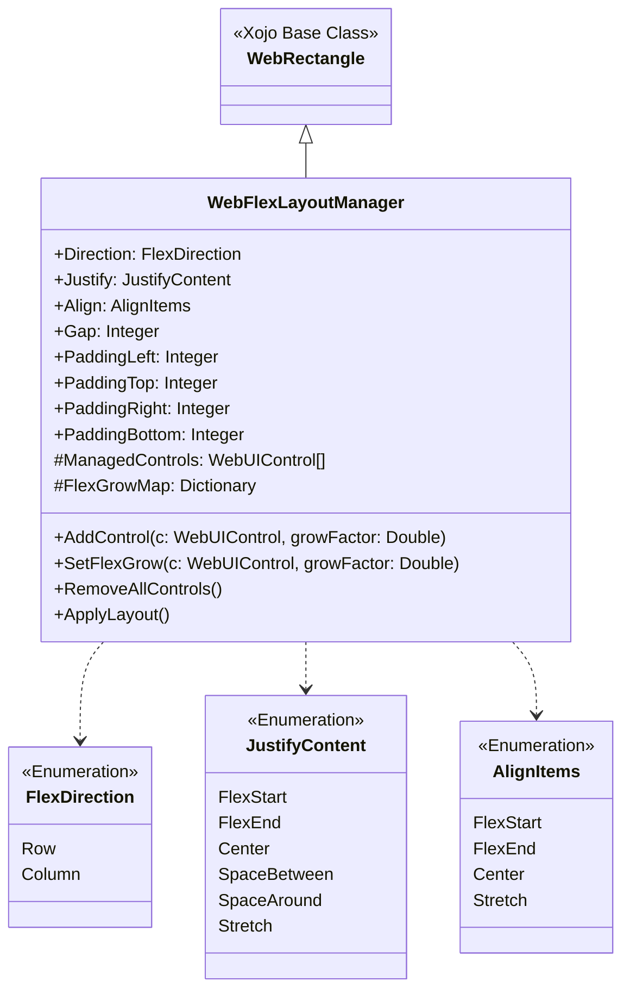
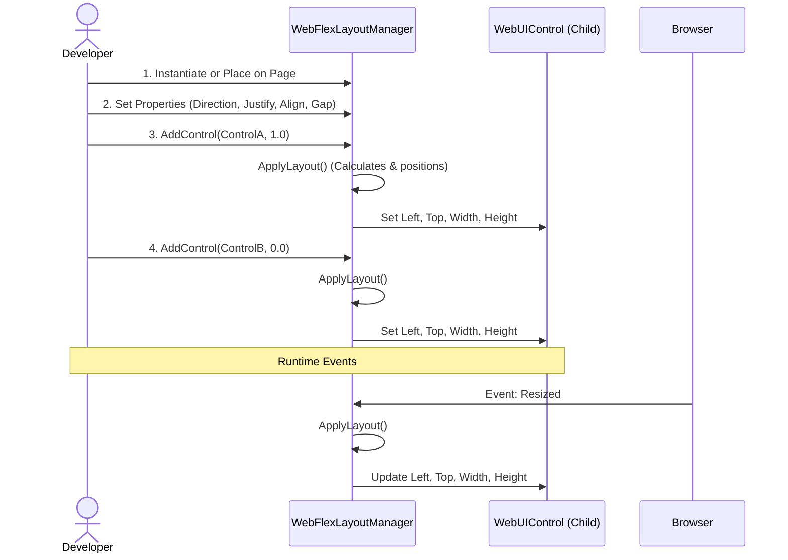
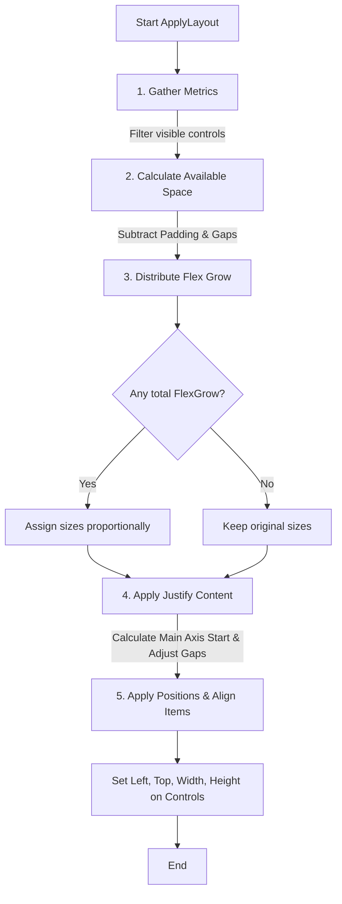

# WebFlexLayoutManager Documentation

## Introduction

The `WebFlexLayoutManager` is a custom layout manager class for Xojo Web applications. It is designed to mimic the behavior of CSS Flexbox, allowing developers to create highly responsive and dynamic user interfaces without manually writing complex resize logic.

By acting as a container (inheriting from `WebRectangle`), it automatically manages the positioning and sizing of any UI controls added to it, adapting dynamically to browser window resizing and control visibility changes.

### Basic Concept

Instead of manually setting `Left`, `Top`, `Width`, `Height` for each control and writing complex resize handlers, you simply:
1. Add controls to the layout manager
2. Specify how they should grow/shrink
3. Call `ApplyLayout()` whenever the browser window size changes

```vb
// Traditional Xojo Web approach (complex and error-prone)
Sub Resized()
  Button1.Left = 20
  Button1.Width = (Self.Width - 60) / 2
  Button2.Left = Button1.Left + Button1.Width + 20
  Button2.Width = Button1.Width
End Sub

// FlexLayoutManager approach (clean and declarative)
Sub Opening()
  FlexManager.AddControl(Button1, 1)  // Both buttons share space equally
  FlexManager.AddControl(Button2, 1)
End Sub

Sub Resized()
  FlexManager.ApplyLayout()  // One line handles everything!
End Sub
```

---

## 1. UML Class Diagram

This diagram shows the structure of the `WebFlexLayoutManager` class, its properties, methods, and related enumerations.



---

## Inheritance and Initialization

The layout manager is built on top of `WebRectangle`, giving it visual bounds on the web page. When initialized, it creates a dictionary to track the flex-grow values of the controls it manages.

```vb
Protected Class WebFlexLayoutManager
Inherits WebRectangle

	Sub Constructor()
	  // Calling the overridden superclass constructor.
	  Super.Constructor
	  
	  FlexGrowMap = New Dictionary
	End Sub
```

## 2. Sequence Diagram: Initialization and Layout

This sequence diagram illustrates how a Xojo `WebPage` interacts with the `WebFlexLayoutManager` to set up controls and recalculate layouts during resize events.



### Event Handling
The layout manager automatically recalculates when the browser window is resized or when it is first shown. To handle early rendering issues in browsers, a JavaScript event dispatch is triggered when the manager is shown.

```vb
	Sub Resized()
	  ApplyLayout()
	End Sub

	Sub Shown()
	  Me.ExecuteJavaScript("setTimeout(function(){ window.dispatchEvent(new Event('resize')); }, 50);")
	End Sub
```

## Adding Controls to the Layout

To have the manager position a control, use `AddControl()`. You provide the control reference and an optional `growFactor`. The `growFactor` dictates how much of the remaining space the control should consume proportionally. An `ApplyLayout()` is triggered immediately to position the new control.

```vb
	Sub AddControl(c As WebUIControl, growFactor As Double = 0)
	  If c = Nil Then Return
	  
	  System.DebugLog("FlexLayoutManager: Adding control " + c.Name + " with growFactor " + Str(growFactor))
	  
	  ManagedControls.Add(c)
	  FlexGrowMap.Value(c) = growFactor
	  
	  ApplyLayout()
	End Sub
```

## 3. Flow Chart: Layout Algorithm (`ApplyLayout`)

The core of the `WebFlexLayoutManager` is the `ApplyLayout()` method. The flowchart below explains the internal algorithm used to position and size the managed controls.



### Step 1: Gather Metrics
The manager iterates over `ManagedControls`, skipping invisible ones. It calculates the total flex-grow factor across all controls, and sums the size (width or height, depending on direction) of controls that have a `growFactor` of 0.

```vb
  Var visibleControls() As WebUIControl
  Var totalFlexGrow As Double = 0
  Var totalFixedSpace As Integer = 0
  
  For Each c As WebUIControl In ManagedControls
    If c.Visible Then
      visibleControls.Add(c)
      
      Var grow As Double = 0
      If FlexGrowMap.HasKey(c) Then grow = FlexGrowMap.Value(c)
      
      totalFlexGrow = totalFlexGrow + grow
      
      If grow = 0 Then
        If Direction = FlexDirection.Row Then
          totalFixedSpace = totalFixedSpace + c.Width
        Else
          totalFixedSpace = totalFixedSpace + c.Height
        End If
      End If
    End If
  Next
```

### Step 2: Calculate Available Space
The internal dimensions of the layout container are calculated by taking the total size minus the configured padding bounds. It then subtracts the size consumed by gaps and fixed-size elements to determine `remainingSpace`.

```vb
  Var availableMainSpace As Integer
  Var availableCrossSpace As Integer
  
  If Direction = FlexDirection.Row Then
    availableMainSpace = Me.Width - PaddingLeft - PaddingRight
    availableCrossSpace = Me.Height - PaddingTop - PaddingBottom
  Else
    availableMainSpace = Me.Height - PaddingTop - PaddingBottom
    availableCrossSpace = Me.Width - PaddingLeft - PaddingRight
  End If
  
  // Calculate gap space
  Var totalGapSpace As Integer = 0
  If visibleControls.Count > 1 Then
    totalGapSpace = (visibleControls.Count - 1) * Gap
  End If
  
  Var remainingSpace As Integer = availableMainSpace - totalFixedSpace - totalGapSpace
  If remainingSpace < 0 Then remainingSpace = 0
```

### Step 3: Distribute Flex Grow
Controls with a `growFactor > 0` are resized to take a fraction of `remainingSpace` based on their factor relative to the `totalFlexGrow`.

```vb
  For Each c As WebUIControl In visibleControls
    Var size As Integer
    Var grow As Double = 0
    If FlexGrowMap.HasKey(c) Then grow = FlexGrowMap.Value(c)
    
    If grow > 0 And totalFlexGrow > 0 Then
      // Distribute remaining space proportionally
      size = Round((grow / totalFlexGrow) * remainingSpace)
    Else
      // Keep original size for fixed controls
      If Direction = FlexDirection.Row Then
        size = c.Width
      Else
        size = c.Height
      End If
    End If
    
    mainSizes.Add(size)
    totalUsedSpace = totalUsedSpace + size
  Next
```

### Step 4: Apply Justify Content
If no items are meant to grow (`totalFlexGrow = 0`), the layout engine determines where the first item starts and how gaps are distributed based on the `Justify` enum setting. 

```vb
  Select Case Justify
  Case JustifyContent.Center
    Var totalItemsAndGaps As Integer = totalFixedSpace + totalGapSpace
    Var startOffset As Double = (availableMainSpace - totalItemsAndGaps) / 2.0
    If Direction = FlexDirection.Row Then
      currentMainPos = PaddingLeft + startOffset
    Else
      currentMainPos = PaddingTop + startOffset
    End If
    
  Case JustifyContent.SpaceBetween
    // Pushes first to start, last to end, recalculates gap
    If Direction = FlexDirection.Row Then
      currentMainPos = PaddingLeft
    End If
    If visibleControls.Count > 1 Then
      actualGap = (availableMainSpace - totalFixedSpace) / (visibleControls.Count - 1)
    End If
  End Select
```

### Step 5: Position each control
Finally, the cross-axis coordinates are determined using the `Align` setting. The Xojo control properties (`Left`, `Top`, `Width`, `Height`) are updated explicitly, and the loop advances to position the next control.

```vb
  For i As Integer = 0 To visibleControls.LastIndex
    Var c As WebUIControl = visibleControls(i)
    Var mainSize As Integer = mainSizes(i)
    Var crossPos As Integer
    Var crossSize As Integer
    
    // Example: cross-axis calculation for Center alignment
    If Align = AlignItems.Center Then
      If Direction = FlexDirection.Row Then
        crossPos = PaddingTop + Round((availableCrossSpace - crossSize) / 2.0)
      Else
        crossPos = PaddingLeft + Round((availableCrossSpace - crossSize) / 2.0)
      End If
    End If
    
    // Apply physical location to UI control
    If Direction = FlexDirection.Row Then
      c.Left = Round(currentMainPos)
      c.Top = crossPos
      c.Width = mainSize
      c.Height = crossSize
    Else
      c.Left = crossPos
      c.Top = Round(currentMainPos)
      c.Width = crossSize
      c.Height = mainSize
    End If
    
    // Advance tracking position for next item in loop
    currentMainPos = currentMainPos + mainSize + actualGap
  Next
```

## 4. Detailed API Reference

### Properties

#### `Direction` (FlexDirection)
Defines whether items are laid out horizontally or vertically.

```vb
// Row: Items arranged left-to-right (horizontal toolbar)
FlexManager1.Direction = FlexDirection.Row
FlexManager1.AddControl(Button1, 0)
FlexManager1.AddControl(Button2, 0)
FlexManager1.AddControl(TextField1, 1)  // TextField expands to fill
// Result: [Button1] [Button2] [=========TextField=========]

// Column: Items arranged top-to-bottom (vertical sidebar)
FlexManager2.Direction = FlexDirection.Column
FlexManager2.AddControl(Logo, 0)
FlexManager2.AddControl(MenuList, 1)     // ListBox expands vertically
FlexManager2.AddControl(StatusLabel, 0)
// Result:
// [Logo]
// [                         ]
// [       MenuList          ]
// [       (expands)         ]
// [                         ]
// [StatusLabel]
```

#### `Justify` (JustifyContent)
Controls how items are distributed along the main axis (horizontal for Row, vertical for Column).

```vb
FlexManager.Direction = FlexDirection.Row
FlexManager.AddControl(Btn1, 0)
FlexManager.AddControl(Btn2, 0)
FlexManager.AddControl(Btn3, 0)

// FlexStart (default): Items packed at the start
FlexManager.Justify = JustifyContent.FlexStart
// [Btn1][Btn2][Btn3]                       (space on right)

// FlexEnd: Items packed at the end
FlexManager.Justify = JustifyContent.FlexEnd
//                     [Btn1][Btn2][Btn3]   (space on left)

// Center: Items centered
FlexManager.Justify = JustifyContent.Center
//          [Btn1][Btn2][Btn3]              (space on both sides)

// SpaceBetween: First at start, last at end, equal space between
FlexManager.Justify = JustifyContent.SpaceBetween
// [Btn1]        [Btn2]        [Btn3]

// SpaceAround: Equal space around each item
FlexManager.Justify = JustifyContent.SpaceAround
//   [Btn1]   [Btn2]   [Btn3]

// Stretch: Items resized equally to fill space (when no FlexGrow)
FlexManager.Justify = JustifyContent.Stretch
// [=====Btn1=====][=====Btn2=====][=====Btn3=====]
```

#### `Align` (AlignItems)
Controls how items are aligned on the cross axis (perpendicular to main axis).

```vb
FlexManager.Direction = FlexDirection.Row
FlexManager.Height = 100
FlexManager.AddControl(SmallBtn, 0)   // 30px height
FlexManager.AddControl(BigBtn, 0)     // 60px height

// FlexStart: Align to top
FlexManager.Align = AlignItems.FlexStart
// SmallBtn at top, BigBtn at top
// ┌───────────┐
// │[Btn] [Btn]│
// │         []│
// │           │
// └───────────┘

// FlexEnd: Align to bottom
FlexManager.Align = AlignItems.FlexEnd
// SmallBtn at bottom, BigBtn at bottom
// ┌────────────┐
// │            │
// │          []│
// │[Btn]  [Btn]│
// └────────────┘

// Center: Vertically centered
FlexManager.Align = AlignItems.Center
// Both buttons centered vertically
// ┌────────────┐
// │            │
// │[Btn]     []│
// │          []│
// │            │
// └────────────┘

// Stretch: Items stretched to fill height
FlexManager.Align = AlignItems.Stretch
// SmallBtn becomes 100px height, BigBtn becomes 100px height
// ┌────────────┐
// │[          ]│
// │[Btn] [    ]│
// │[    ] [Btn]│
// │[          ]│
// └────────────┘
```

#### `Gap` (Integer)
Fixed pixel spacing between items.

```vb
FlexManager.Gap = 10
FlexManager.AddControl(Btn1, 0)
FlexManager.AddControl(Btn2, 0)
FlexManager.AddControl(Btn3, 0)
// Result: [Btn1]---10px---[Btn2]---10px---[Btn3]

FlexManager.Gap = 0
// Result: [Btn1][Btn2][Btn3] (items touch each other)
```

#### `PaddingLeft / Right / Top / Bottom` (Integer)
Inner padding between the layout manager's borders and its managed controls.

```vb
// Create a card-like panel with internal spacing
FlexManager.PaddingLeft = 20
FlexManager.PaddingRight = 20
FlexManager.PaddingTop = 15
FlexManager.PaddingBottom = 15

FlexManager.AddControl(TitleLabel, 0)
FlexManager.AddControl(ContentArea, 1)
FlexManager.AddControl(ActionButton, 0)

// Visual representation:
// ┌─────────────────────────────────┐
// │ (15px padding top)              │
// │   [TitleLabel]                  │
// │ (gap)                           │
// │   [=========================]   │
// │   [     ContentArea         ]   │
// │   [     (grows to fill)     ]   │
// │   [=========================]   │
// │ (gap)                           │
// │   [ActionButton]                │
// │ (15px padding bottom)           │
// └─────────────────────────────────┘
// ←─────────────────────────────────→
//      (20px padding left/right)
```

---

### Methods

#### `AddControl(c As WebUIControl, growFactor As Double = 0)`
Registers a control to be managed by the layout manager.

**Parameters:**
- `c`: The UI control to manage
- `growFactor`: How much the control should grow relative to others
  - `0`: Control keeps its original size (fixed)
  - `1`: Gets proportional share of remaining space
  - `2`: Gets twice as much space as factor `1`

```vb
// Example 1: Simple toolbar with one expanding search field
Sub Opening()
  // Fixed buttons (growFactor = 0)
  Toolbar.AddControl(btnBack, 0)      // Stays at designed width
  Toolbar.AddControl(btnForward, 0)   // Stays at designed width
  
  // Expanding search field (growFactor = 1)
  Toolbar.AddControl(txtSearch, 1)    // Expands to fill available space
  
  // Fixed buttons
  Toolbar.AddControl(btnRefresh, 0)
  Toolbar.AddControl(btnSettings, 0)
  
  Toolbar.ApplyLayout()
End Sub

// Example 2: Sidebar with proportional sizing
Sub Opening()
  Sidebar.Direction = FlexDirection.Column
  
  // Header - fixed height
  Sidebar.AddControl(pnlHeader, 0)    // Fixed at 60px height
  
  // Navigation - takes 1/4 of remaining space
  Sidebar.AddControl(lstNavigation, 1)
  
  // Content area - takes 3/4 of remaining space (3x larger than navigation)
  Sidebar.AddControl(lstContent, 3)
  
  // Footer - fixed height
  Sidebar.AddControl(pnlFooter, 0)    // Fixed at 40px height
  
  Sidebar.ApplyLayout()
End Sub

// Visual result of Example 2 (400px available height):
// ┌─────────────────┐
// │   Header (60px) │  ← pnlHeader (fixed)
// ├─────────────────┤
// │                 │
// │  Navigation     │  ← lstNavigation (gets 70px = 1/4 of 280px)
// │   (70px)        │
// ├─────────────────┤
// │                 │
// │                 │
// │    Content      │  ← lstContent (gets 210px = 3/4 of 280px)
// │   (210px)       │
// │                 │
// │                 │
// ├─────────────────┤
// │  Footer (40px)  │  ← pnlFooter (fixed)
// └─────────────────┘
```

#### `SetFlexGrow(c As WebUIControl, growFactor As Double)`
Updates the flex-grow factor of a control that has already been added. Useful for dynamic layout changes.

```vb
// Example: Toggle between compact and expanded view
Sub btnToggleMode.Pressed()
  If CompactMode Then
    // Switch to expanded mode - give more space to content
    MainLayout.SetFlexGrow(Sidebar, 1)
    MainLayout.SetFlexGrow(ContentArea, 3)
    CompactMode = False
  Else
    // Switch to compact mode - sidebar takes less space
    MainLayout.SetFlexGrow(Sidebar, 0)  
    MainLayout.SetFlexGrow(ContentArea, 1)
    CompactMode = True
  End If
  
  MainLayout.ApplyLayout()  // Apply the new proportions
End Sub

// Example: Dynamic form field sizing
Sub cmbType.Changed()
  Select Case cmbType.SelectedRowValue
  Case "Simple"
    FormLayout.SetFlexGrow(SimpleFields, 1)
    FormLayout.SetFlexGrow(AdvancedFields, 0)
    AdvancedFields.Visible = False
  Case "Advanced"
    FormLayout.SetFlexGrow(SimpleFields, 1)
    FormLayout.SetFlexGrow(AdvancedFields, 2)
    AdvancedFields.Visible = True
  End Select
  
  FormLayout.ApplyLayout()
End Sub
```

#### `RemoveAllControls()`
Clears all managed controls from the layout manager.

```vb
// Example: Reset layout when switching views
Sub btnReset.Pressed()
  MainLayout.RemoveAllControls()
  // Now add new controls for different view
  MainLayout.AddControl(NewControl1, 1)
  MainLayout.AddControl(NewControl2, 1)
  MainLayout.ApplyLayout()
End Sub
```

#### `ApplyLayout()`
Forces the layout manager to recalculate all positions and sizes. **Must be called manually** after adding all controls, and inside the Page's `Resized` event.

```vb
// WHEN to call ApplyLayout()

// 1. After adding controls in Opening event
Sub Opening()
  LayoutManager.AddControl(Button1, 0)
  LayoutManager.AddControl(Button2, 1)
  LayoutManager.ApplyLayout()  // <-- REQUIRED
End Sub

// 2. When browser window is resized
Sub Resized()
  LayoutManager.ApplyLayout()  // <-- REQUIRED for responsiveness
End Sub

// 3. After changing visibility of controls
Sub chkShowOptions.ValueChanged()
  OptionsPanel.Visible = chkShowOptions.Value
  LayoutManager.ApplyLayout()  // <-- Recalculate with/without the panel
End Sub

// 4. After dynamically adding/removing controls
Sub btnAddField.Pressed()
  Var newField As New WebTextField
  Self.AddControl(newField)
  LayoutManager.AddControl(newField, 1)
  LayoutManager.ApplyLayout()  // <-- Include the new field
End Sub

// 5. After changing layout properties
Sub cmbDirection.Changed()
  If cmbDirection.SelectedRowIndex = 0 Then
    LayoutManager.Direction = FlexDirection.Row
  Else
    LayoutManager.Direction = FlexDirection.Column
  End If
  LayoutManager.ApplyLayout()  // <-- Apply new direction
End Sub
```

---

## 5. Complete Real-World Examples

### Example 1: Responsive Navigation Bar

```vb
// Navigation bar with logo, menu items, and search
Sub Opening()
  // Configure horizontal layout
  NavBar.Direction = FlexDirection.Row
  NavBar.Justify = JustifyContent.FlexStart
  NavBar.Align = AlignItems.Center
  NavBar.Gap = 15
  NavBar.PaddingLeft = 20
  NavBar.PaddingRight = 20
  
  // Logo (fixed width)
  Logo.Width = 120
  NavBar.AddControl(Logo, 0)
  
  // Menu buttons (fixed)
  NavBar.AddControl(btnHome, 0)
  NavBar.AddControl(btnProducts, 0)
  NavBar.AddControl(btnAbout, 0)
  
  // Search field (expands to fill remaining space)
  NavBar.AddControl(txtSearch, 1)
  
  // User menu (fixed)
  NavBar.AddControl(btnProfile, 0)
  
  NavBar.ApplyLayout()
End Sub

Sub Resized()
  NavBar.ApplyLayout()
End Sub

// Result at 1000px width:
// [Logo(120px)] [Home] [Products] [About] [=====Search=====] [Profile]
```

### Example 2: Dashboard with Cards

```vb
// Horizontal row of equal-width cards
Sub Opening()
  CardsLayout.Direction = FlexDirection.Row
  CardsLayout.Justify = JustifyContent.SpaceBetween
  CardsLayout.Align = AlignItems.Stretch
  CardsLayout.Gap = 20
  CardsLayout.PaddingLeft = 20
  CardsLayout.PaddingRight = 20
  
  // Each card has equal width (all growFactor = 1)
  CardsLayout.AddControl(CardSales, 1)
  CardsLayout.AddControl(CardUsers, 1)
  CardsLayout.AddControl(CardRevenue, 1)
  CardsLayout.AddControl(CardGrowth, 1)
  
  CardsLayout.ApplyLayout()
End Sub

Sub Resized()
  CardsLayout.ApplyLayout()
End Sub

// Result at different widths:
// Wide (1200px):  [====Card1====][====Card2====][====Card3====][====Card4====]
// Medium (800px): [==Card1==][==Card2==][==Card3==][==Card4==]
```

### Example 3: Settings Panel with Sections

```vb
Sub Opening()
  // Vertical stack of settings sections
  SettingsLayout.Direction = FlexDirection.Column
  SettingsLayout.Gap = 20
  SettingsLayout.PaddingLeft = 20
  SettingsLayout.PaddingRight = 20
  SettingsLayout.PaddingTop = 20
  SettingsLayout.PaddingBottom = 20
  
  // Header section (fixed)
  SettingsLayout.AddControl(lblTitle, 0)
  
  // General settings (expands)
  SettingsLayout.AddControl(grpGeneral, 1)
  
  // Advanced settings (hidden by default)
  grpAdvanced.Visible = False
  SettingsLayout.AddControl(grpAdvanced, 2)
  
  // Button bar at bottom (fixed)
  SettingsLayout.AddControl(pnlButtons, 0)
  
  SettingsLayout.ApplyLayout()
End Sub

Sub btnShowAdvanced.Pressed()
  grpAdvanced.Visible = True
  SettingsLayout.ApplyLayout()  // Recalculate with new section
End Sub

Sub Resized()
  SettingsLayout.ApplyLayout()
End Sub
```

### Example 4: Responsive Form Layout

```vb
Sub Opening()
  // Form fields in a column
  FormLayout.Direction = FlexDirection.Column
  FormLayout.Gap = 10
  FormLayout.PaddingLeft = 20
  FormLayout.PaddingRight = 20
  FormLayout.Align = AlignItems.Stretch  // Fields stretch to full width
  
  // Label (fixed height)
  FormLayout.AddControl(lblName, 0)
  
  // TextField (fixed height)
  txtName.Height = 30
  FormLayout.AddControl(txtName, 0)
  
  FormLayout.AddControl(lblEmail, 0)
  
  txtEmail.Height = 30
  FormLayout.AddControl(txtEmail, 0)
  
  // Comments textarea (expands vertically)
  FormLayout.AddControl(lblComments, 0)
  FormLayout.AddControl(txtComments, 1)
  
  // Button row
  FormLayout.AddControl(pnlButtons, 0)
  
  FormLayout.ApplyLayout()
End Sub

Sub Resized()
  FormLayout.ApplyLayout()
End Sub
```

---

## 6. Common Patterns and Best Practices

### Pattern 1: Fixed Header + Scrollable Content + Fixed Footer

```vb
Sub Opening()
  MainLayout.Direction = FlexDirection.Column
  MainLayout.Align = AlignItems.Stretch
  
  // Header - fixed 60px
  Header.Height = 60
  MainLayout.AddControl(Header, 0)
  
  // Content - expands to fill available space
  MainLayout.AddControl(ScrollableContent, 1)
  
  // Footer - fixed 40px
  Footer.Height = 40
  MainLayout.AddControl(Footer, 0)
  
  MainLayout.ApplyLayout()
End Sub
```

### Pattern 2: Centered Dialog Content

```vb
Sub Opening()
  DialogLayout.Direction = FlexDirection.Column
  DialogLayout.Justify = JustifyContent.Center  // Center vertically
  DialogLayout.Align = AlignItems.Center         // Center horizontally
  DialogLayout.Gap = 20
  
  DialogLayout.AddControl(IconImage, 0)
  DialogLayout.AddControl(MessageLabel, 0)
  DialogLayout.AddControl(ButtonPanel, 0)
  
  DialogLayout.ApplyLayout()
End Sub
```

### Pattern 3: Responsive Toolbar

```vb
Sub Opening()
  ToolbarLayout.Direction = FlexDirection.Row
  ToolbarLayout.Justify = JustifyContent.FlexStart
  ToolbarLayout.Align = AlignItems.Center
  ToolbarLayout.Gap = 8
  ToolbarLayout.PaddingLeft = 10
  ToolbarLayout.PaddingRight = 10
  
  // Fixed buttons
  ToolbarLayout.AddControl(btnNew, 0)
  ToolbarLayout.AddControl(btnOpen, 0)
  ToolbarLayout.AddControl(btnSave, 0)
  
  // Expanding search field
  ToolbarLayout.AddControl(txtSearch, 1)
  
  // Fixed buttons on right
  ToolbarLayout.AddControl(btnSettings, 0)
  ToolbarLayout.AddControl(btnHelp, 0)
  
  ToolbarLayout.ApplyLayout()
End Sub
```

---

## 7. Troubleshooting Common Issues

### Issue 1: Controls Not Resizing
```vb
// PROBLEM: Controls stay at their original size
Sub Resized()
  // Forgot to call ApplyLayout!
End Sub

// SOLUTION:
Sub Resized()
  FlexManager.ApplyLayout()  // <-- Add this!
End Sub
```

### Issue 2: Hidden Controls Still Taking Space
```vb
// PROBLEM: Hidden control still occupies space
HiddenPanel.Visible = False
// Layout doesn't change!

// SOLUTION: Call ApplyLayout after changing visibility
HiddenPanel.Visible = False
FlexManager.ApplyLayout()  // Recalculates without hidden control
```

### Issue 3: Layout Not Updating When Adding Controls Dynamically
```vb
// PROBLEM: New control doesn't appear in correct position
Sub AddButton()
  Var btn As New WebButton
  btn.Caption = "New"
  Self.AddControl(btn)
  FlexManager.AddControl(btn, 0)
  // Forgot to reapply layout!
End Sub

// SOLUTION:
Sub AddButton()
  Var btn As New WebButton
  btn.Caption = "New"
  Self.AddControl(btn)
  FlexManager.AddControl(btn, 0)
  FlexManager.ApplyLayout()  // <-- Required!
End Sub
```

### Issue 4: Browser Rendering Timing Issues
```vb
// PROBLEM: Layout appears incorrect on initial page load
// CAUSE: Browser hasn't finished rendering when ApplyLayout is called

// SOLUTION: Use the Shown event to trigger a resize
Sub Shown()
  Me.ExecuteJavaScript("setTimeout(function(){ window.dispatchEvent(new Event('resize')); }, 50);")
End Sub

// This is already built into WebFlexLayoutManager, but if you're experiencing
// issues, you can increase the timeout value (e.g., to 100 or 200ms)
```

### Issue 5: Controls Overlapping or Misaligned
```vb
// PROBLEM: Controls overlap each other or appear in wrong positions
// CAUSE: Parent container size is not set correctly

// SOLUTION: Ensure the WebFlexLayoutManager itself has proper dimensions
Sub Opening()
  // Set explicit size for the layout manager
  FlexManager.Left = 0
  FlexManager.Top = 0
  FlexManager.Width = Self.Width
  FlexManager.Height = Self.Height
  
  // Then add controls
  FlexManager.AddControl(Control1, 1)
  FlexManager.ApplyLayout()
End Sub

Sub Resized()
  // Update layout manager size
  FlexManager.Width = Self.Width
  FlexManager.Height = Self.Height
  FlexManager.ApplyLayout()
End Sub
```

---

## Summary

The `WebFlexLayoutManager` simplifies responsive UI development by:

1. **Eliminating manual resize code** - No more complex math in `Resized()` events
2. **Providing declarative layouts** - Specify intent ("this button should grow"), not pixels
3. **Enabling dynamic layouts** - Change visibility, add/remove controls, adjust proportions at runtime
4. **Supporting modern layout patterns** - Flexbox concepts developers already know from web development

Remember the three key steps:
1. **Configure** - Set Direction, Justify, Align, Gap, Padding properties
2. **Add Controls** - Use `AddControl()` with appropriate `growFactor` values
3. **Apply** - Call `ApplyLayout()` in `Opening` and `Resized` events

For any layout changes during runtime (visibility, new controls, property changes), simply call `ApplyLayout()` again to recalculate everything automatically!
